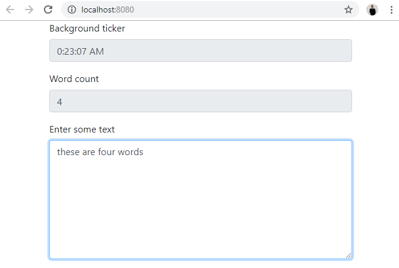

# vue-rx-example

Continuation of the https://github.com/d-led/reactiveexamples repo in the browser

Demo: https://ledentsov.de/static/vue-rx-example/


## Project setup
```
npm install
```

### Compiles and hot-reloads for development
```
npm run serve
```

&darr;



### Compiles and minifies for production
```
npm run build
```

### Run your unit tests
```
npm run test:unit
```
